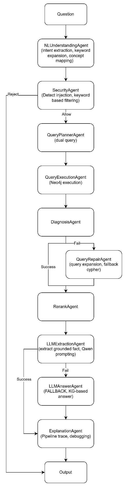

> **Assignment** **5** **Report:** **KG** **Multi-Agent** **QA**
> **System**
>
> **114522101** **梅慈慧**
>
> **1.** **Agent** **Design** **and** **Implementation**
>
> The design emphasizes modularity, which allows each component or agent
> to operate independently and contribute together on the result. The
> system composed of 10 agents, each responsible for a distinct stage of
> the pipeline.
>
> • The NLUnderstandingAgent is responsible for transforming the input
> question into a structured representation by performing lowercasing,
> tokenization, and stopword filtering using a predefined set of
> stopwords. The agent classifies the question into either penalty,
> requirement, prohibition, or general. It also performs domain-specific
> keyword expansion for better query.
>
> • The SecurityAgent evaluates whether a question should be processed
> or rejected. It performs keyword-based filtering against a predefined
> list of forbidden patterns. This agent operates before any database
> interaction, ensuring that unsafe queries are blocked early in the
> pipeline. Here I use keyword filtering, thus new unsafe words might
> pass, which is quite a threat but it’s the simplest and lightweight
> way that doesn’t involve LLMs or other high level security algorithm.
>
> • The QueryPlannerAgent generates Cypher queries based on the
> extracted intent. It constructs two queries that rely on Neo4j
> indexes, specifically rule_idx and article_content_idx.The queries
> return rulemetadata and associated article content. This dual query
> approach can use typed query that focusing on relevance and the broad
> query for improving coverage.
>
> • The QueryExecutionAgent executes the generated queries against the
> Neo4j database. It ensures that no write operations are present in the
> queries by checking for keywords such as "create", "delete", "merge",
> and "set". If no results are retrieved, the agent returns an empty
> list along with an error message.
>
> • The DiagnosisAgent determines the status of the system after query
> execution. It classifies the result into one of four categories:
> SUCCESS, QUERY_ERROR, SCHEMA_MISMATCH, or NO_DATA. This is to ensure
> that retrieved results are present and also aligned with the meaning
> of the question.
>
> • The QueryRepairAgent is activated when the diagnosis indicates a
> failure. It generates a new query using alternative keywords or
> expanded keywords based on the concept. If schema mismatch, then it
> switches to a broader cypher query. The repair process is only one
> single iteration like the tasks requirement.
>
> •     The RerankAgent reorders the retrieved results using a scoring
> function that combines semantic similarity between the question and
> the result content, keyword
>
> overlap, rule type matching, concept keyword matches, and the original
> Neo4j score with a fixed weighting schema. Here, I also experimented
> using different weights for each element for a better result.
>
> • The LLMExtractionAgent is responsible for extracting the final
> answer from the top-ranked results. It selects the top three results
> and formats them into structured evidence. This evidence is then
> passed to a LLM (here I use Qwen) with strict instructions to extract
> only the specific fact that answers the question. If the extraction
> fails or not grounded, the agent returns None, and trigger the
> fallback mechanism.
>
> • The LLMAnswerAgent serves as a fallback when extraction fails. It
> uses the top evidence entries to generate a short answer. This ensures
> the system always produces an output, even in failure cases.
>
> • The ExplanationAgent generates a structured explanation string
> summarizing the pipeline outcome. It includes the intent type,safety
> decision, diagnosis result,repair status, and final answer. This agent
> is use for debugging and easier to evaluate the system.
>
> **2.** **Major** **Design** **Decisions**
>
> This system uses hybrid architecture that combines rule based
> processing and language models. The natural language understanding,
> security validation, query planning, and diagnosis are deterministic.
> I use a deterministic design to avoid the risk of hallucinations and
> to ensure the stability. The LLM is used only in final stages for more
> flexible extraction and fallback answering. Even so, the LLM still
> have some grounding rules to follow.
>
> The system also use concept based reasoning in retrieval and
> diagnosis. Instead of relyin only on keyword matching, the query is
> also mapped to concept. By using this method, it improves consistency
> across different phrases of similar questions and make sure that
> retrieved results are semantically align. I also use dual query
> strategy by combining rule level full text search and broader search
> (article level) to have higher precision and deal with cases where
> strict matching fails.
>
> The system also includes explicit handling of failure cases through
> diagnosis and repair. When retrieval fails, a repair query is
> generated using concept related or using expanded keywords. This is to
> let the system recover from over restricted queries or vague or overly
> broad questions.
>
> **3.** **Difficulties** **and** **Solutions**
>
> The most difficulties comes from the fact that retrieval results are
> not actually answer the question. The query does return a valid
> entries, but sometimes they are not relevant. This issue is addressed
> by introducing a concept based validation (by diagnosis agent). The
> agent will check whether the concept related keywords appear in the
> retrieved content. I also do experiments with embedding toget semantic
> similarityto further improve the filtering quality.
>
> The second challenge is the inconsistency of LLM output, e.g. 2 years
> and two years. For some cases, the output can be full sentence,
> instead of short answer. To deal with this, I use a normalization to
> standardizes the format. But even so, sometimesthe generated answer
> still not meet the requirement.
>
> Another challenges happend when initial queries fail to retrieve any
> results. This is addressed by the query repair agent, which generates
> alternative queries using broader or concept specific keywords, with a
> limit of one iteration.
>
> Handling vague or ambiguous questions is another difficulty. Some
> queries do not have enough information for reliable mapping. To deal
> with these kind of query, the system have predefined patterns and
> treated it as no data to prevent unnecessary retrieval attempts.
>
> The last one is a issue from the grading system, it uses a word level
> matching. Even when the system output correct answers, differences in
> wording or format would be mark as incorrect. Although this motivates
> me to make the system having a strict output and more concise answer
> constraint, I still could not perfectly handle this issue. This is the
> part where I could work more in the future.
>
> **4.** **Key** **Findings** **and** **Insights**
>
> The implementation shows that retrieving data from a knowledge graph
> is not enough to guarantee correct answers. Without additional
> validation, the system may return results that are valid in structure,
> but not related to the user's intent. The introduction of concept
> based validation significantly improves the reliability of the system,
> but still asemi hard-coded part.The reason I use a semi hard coded for
> this task is because I have a limited computational resource and could
> not handle model to do the validation. Another things that I observe
> is that rule based approaches can be highly effective in constrained
> domains. This method is simple, but can provide stable and predictable
> behavior, which is essential for evaluation. In contrast with purely
> LLM based system, this design reduces the variability across the
> queries. The system also demonstrate that query quality is a very
> critical factor in knowledge graph QA. The dual query strategy can
> help balance the retrieval, which is essential for real world
> variation in natural language. A strict full text
>
> queries can improve the accuracy while broad queries help recover from
> no matches cases in case the rule is too strict or use different
> phrase.
>
> Another observation is language models must be carefully constrained
> to avoid hallucination. By limiting their role to extraction based on
> the evidence, and provide strict instructions, the system can make
> sure that answers remain grounded to the evidence.Also, the repair
> mechanism can improves robustness by allowing the system to recover
> from initial failures, but it must be carefully controlled to avoid
> introducing irrelevant results.

